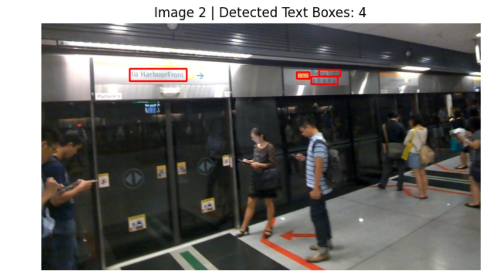
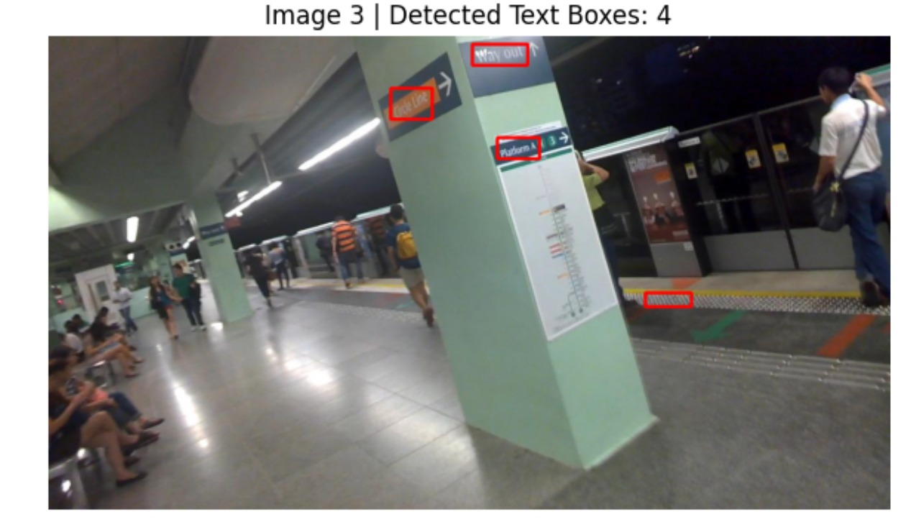
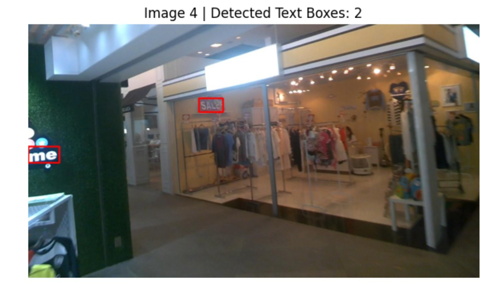
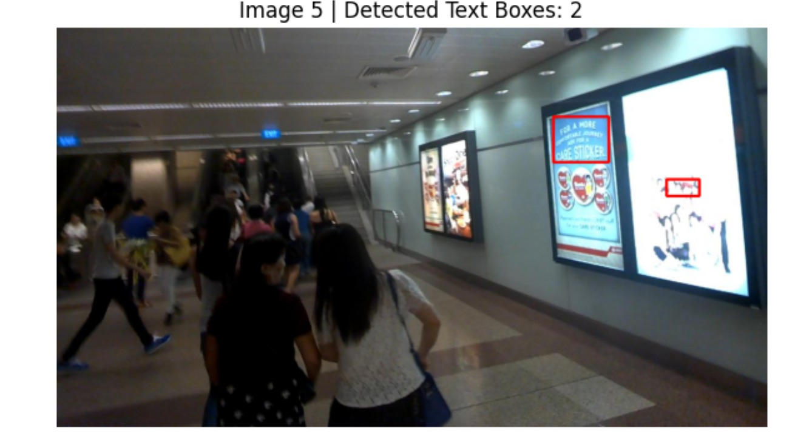
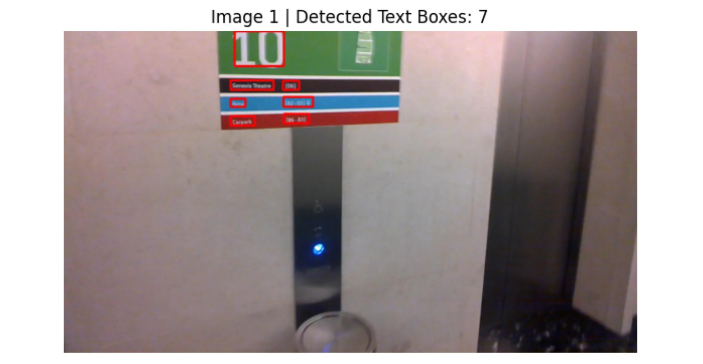

# Feature-Level Fusion for Scene Text Detection

This project implements **feature-level fusion** as an ensemble technique using  
**EAST** and **CRAFT** text detection models to improve scene text detection performance.

---

## 🔹 Methodology
- EAST provides fast coarse text region probability maps
- CRAFT provides fine-grained character-level confidence maps
- Both feature maps are spatially aligned and normalized
- Feature-level fusion is performed using weighted averaging
- Final text regions are obtained via thresholding and morphological processing

---

## 🔹 Dataset
- **ICDAR 2015 Scene Text Dataset**
- Evaluation performed on **500 images**

---

## 🔹 Evaluation Metrics (500 Images)

| Metric    | Value |
|----------|-------|
| Precision | 0.63  |
| Recall    | 0.28  |
| F1-score  | 0.39  |

---

## 🔹 Qualitative Results (Feature-Level Fusion)

### Image 1

### Image 2

### Image 3

### Image 4

### Image 5

---

## 🔹 Key Highlights
- Feature-level fusion improves robustness over individual detectors
- CRAFT enhances recall for small text regions
- EAST stabilizes detection of larger text areas
- The ensemble achieves better balance between precision and recall

---

## 🔹 Technologies Used
- Python
- OpenCV
- PyTorch
- EAST Text Detector
- CRAFT Text Detector

---

## 🔹 Author
**Anwesha Guha**  
B.Tech (AIML)  
Netaji Subhash Engineering College, Kolkata
